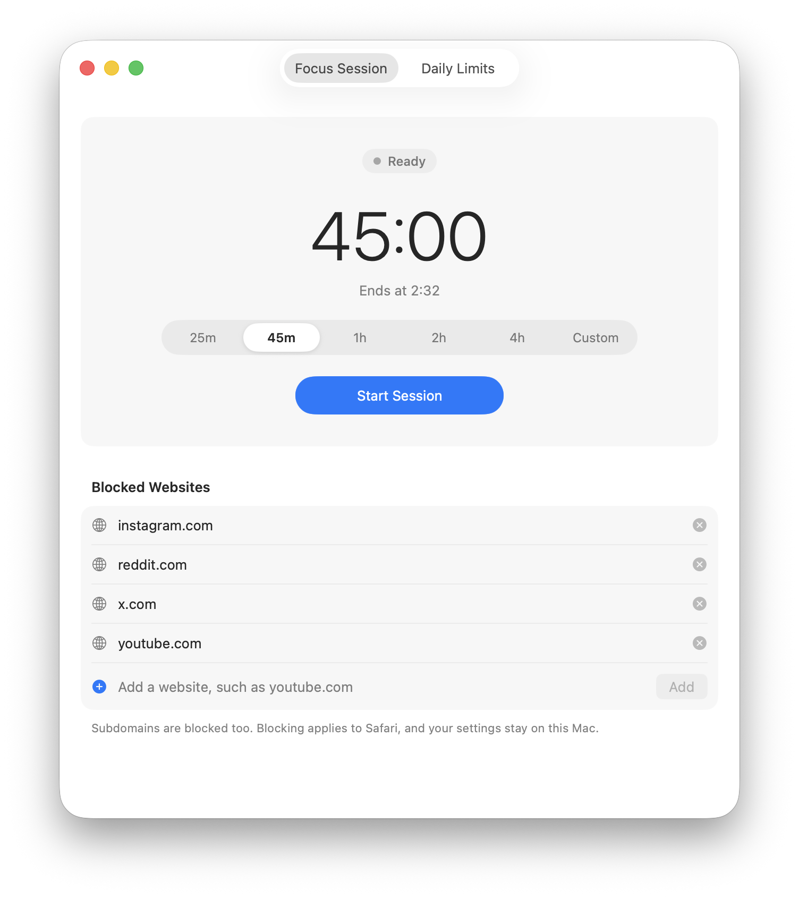

# Focusward

Focusward is a free, local-only Safari website blocker for macOS. It adds deliberate friction between an impulse and a distracting website without a browser extension, server, account, or protected-system modification.

<p align="center">
  <picture>
    <source media="(prefers-color-scheme: dark)" srcset="docs/images/focusward-dark.png">
    
  </picture>
</p>

## Features

- Blocks configured Safari websites during timed sessions.
- Preset and custom session lengths up to 30 days.
- Gives each configured website a separate daily allowance.
- Counts daily use only for the active Safari tab while Safari is in front.
- Resets daily allowances at local midnight.
- Local shield page with no remote resources.
- Cancelable early-end cooldown that advances only while Focusward is in front.
- Local session recovery after relaunching the app.
- Local daily-limit recovery after relaunching the app.
- Universal `arm64` and `x86_64` build.

## Privacy

Focusward has no backend, analytics, crash uploader, update checker, or networking implementation. Safari supplies complete tab URLs while protection is active, but Focusward extracts only the hostname in memory and does not persist or log browsing history, paths, or query parameters. See [Security and privacy notes](docs/SECURITY.md) for the complete boundary and known limitations.

## Install from source

Requirements:

- macOS 14 or later to run Focusward
- Safari
- Xcode 26.5 to build from source (tested configuration)

Clone or download this repository, quit Focusward if it is already running, and run:

```sh
./install.sh
```

The script builds a universal Release app locally, verifies its code signature and architectures, and installs it at `/Applications/Focusward.app`. The build contains native Apple Silicon and Intel slices; Apple Silicon is tested, while execution on physical Intel hardware has not yet been tested. No paid Apple Developer membership or prebuilt binary is required. macOS may show its standard one-time administrator prompt if your account cannot write to the system Applications folder; Focusward itself never runs as root or installs a privileged helper.

To update, pull the latest source and run `./install.sh` again.

The first Safari interaction causes macOS to ask whether Focusward may control Safari. Choose **Allow**. If permission was previously denied, enable Focusward under **System Settings → Privacy & Security → Automation**.

## Uninstall

The repository is only the source used to build Focusward. You may delete it after installation, but doing so does not remove the installed app, its settings, or its Automation permission. You will need to clone it again to build future updates.

To uninstall Focusward, quit it and move `/Applications/Focusward.app` to the Trash. That is sufficient for a normal uninstall. To also erase its local settings and Safari Automation permission, run:

```sh
defaults delete app.focusward.local
tccutil reset AppleEvents app.focusward.local
```

## Development and testing

Open `Focusward.xcodeproj` in Xcode, select **My Mac**, and run the `Focusward` scheme.

Command-line tests:

```sh
DEVELOPER_DIR=/Applications/Xcode.app/Contents/Developer \
  xcodebuild -project Focusward.xcodeproj \
  -scheme Focusward \
  -derivedDataPath /tmp/FocuswardDerived \
  -destination 'platform=macOS' \
  test
```

Xcode's **Debug** and **Release** configurations are project settings and remain in the repository. Debug is used for development and tests; Release is optimized for installation. Generated apps and intermediate files under `build/` and `DerivedData/` are ignored by Git and can be deleted safely.

## Enforcement limits

Focusward is a deliberate-friction tool, not a tamper-proof security boundary. It is Safari-only and reacts shortly after top-level navigation begins. Force Quit, process termination, reboot, preference deletion, and system-clock changes remain recovery paths. See [the security notes](docs/SECURITY.md#enforcement-limits) for additional caveats.

## License

Focusward is available under the [MIT License](LICENSE).
